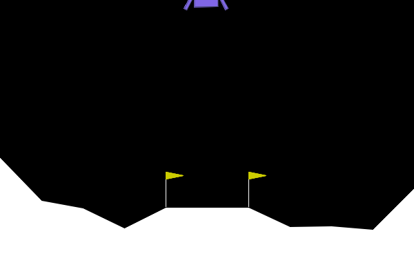
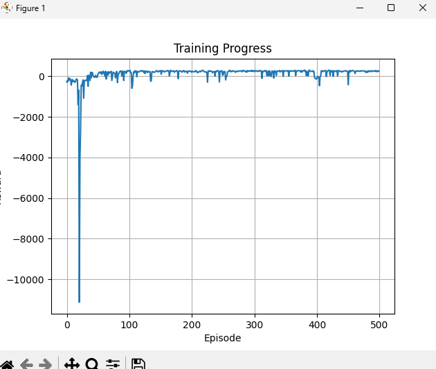
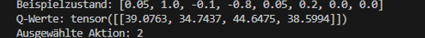
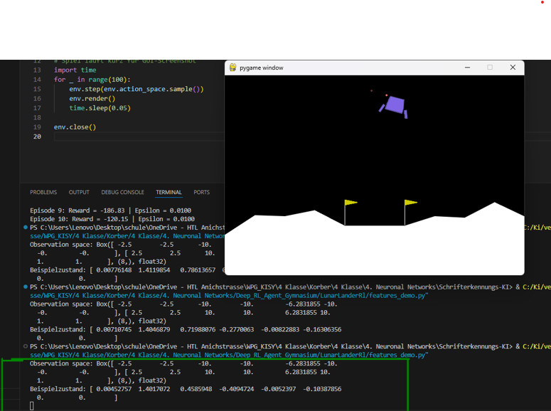

# LunarLanderRl – Deep Reinforcement Learning Agent mit Gymnasium

Dieses Projekt wurde im Rahmen des KISY-Unterrichts erstellt. Ziel ist es, einen Deep Q-Learning Agenten zu trainieren, der das Spiel **LunarLander-v3** mithilfe der Bibliothek **gymnasium** meistert.


---

## 🗂️ Ordnerstruktur

```
LunarLanderRl/
│
├── main.py                 # Training des Agenten
├── dqn_agent.py            # DQNAgent-Klasse mit Q-Network
├── utils.py                # Plotfunktion für Rewards
├── replay.py               # Spiel mit gespeichertem Modell wiedergeben
├── features_demo.py        # Zeigt Spielzustand & Feature-Werte
├── qvalue_demo.py          # Zeigt Q-Werte für fixen Zustand
├── modell/                 # Gespeicherte Modelle (.pth)
├── Gymnasium_Aufgabe.odt   # Word-Dokumentation
├── images//                # Bilder für readme
└── reward_plot.png         # Automatisch generierter Trainingsplot
```

---

## 📦 Installation

Voraussetzungen:

- Python 3.12  
- Installation der Bibliotheken:

```bash
pip install gymnasium[box2d] torch matplotlib
```

---

## 🚀 Features (Inputs für das neuronale Netz)

Das Environment liefert 8 Zustandswerte:

1. Horizontale Position  
2. Vertikale Position  
3. Horizontale Geschwindigkeit  
4. Vertikale Geschwindigkeit  
5. Neigungswinkel  
6. Winkelgeschwindigkeit  
7. Kontakt linker Fuß  
8. Kontakt rechter Fuß  

Diese Features beschreiben die physikalische Lage des Landers vollständig.

---

## 🧠 Training starten

```bash
python main.py
```

- Führt z. B. 10 Trainings-Episoden aus  
- Speichert das Modell in `modell/lunarlander_model.pth`  
- Zeichnet Rewards auf und erzeugt `reward_plot.png`

---

## 🎮 Replay mit gespeichertem Modell

```bash
python replay.py
```

→ Gib bei der Eingabeaufforderung den Modellpfad ein, z. B.:

```
C:\...\LunarLanderRl\modell\lunarlander_model.pth
```

Der Agent spielt das Spiel basierend auf dem trainierten Q-Network.

---

## 🔎 Beispielzustand & gewählte Aktion

```bash
python qvalue_demo.py
```

Zeigt:

- Einen Beispielzustand (state) mit 8 Werten  
- Die berechneten Q-Werte  
- Die vom Modell gewählte Aktion

---

## 📊 Feature-Demo & GUI

```bash
python features_demo.py
```

Zeigt:

- Die 8 Beobachtungswerte vom Environment  
- Das laufende Spiel im Fenster (env.render)  

---

## 🧮 Wie funktionieren die Rewards bei LunarLander?

Das Spiel **belohnt** oder **bestraft** Aktionen basierend auf physikalisch sinnvollem Verhalten. Der Agent soll weich auf einer Plattform landen – alles andere wird bestraft.

### ✅ Positive Rewards (Belohnungen)

| Aktion                                   | Belohnung           | Beschreibung |
|------------------------------------------|----------------------|--------------|
| Sanfte Landung auf der Plattform         | +100 bis +140        | Wenn beide Beine sicher Bodenkontakt haben. |
| Landebeine berühren Boden                | +10 pro Bein         | Auch bei Zwischenlandungen gibt es Punkte. |
| Guter Flug in Richtung Plattform         | +0 bis +100          | Belohnung für zentriertes, langsames Sinken. |

---

### ❌ Negative Rewards (Strafen)

| Aktion                                   | Strafe              | Beschreibung |
|------------------------------------------|----------------------|--------------|
| Absturz (explodieren)                    | -100 bis -150        | Bei harter oder schiefer Landung. |
| Fliegen ohne zu landen                   | -0.03 pro Frame      | Dauerhafte Strafe, um Effizienz zu erzwingen. |
| Aus dem Bild fliegen                     | -100                 | Wenn das Schiff das Spielfeld verlässt. |
| Hartes Aufprallen mit einem Bein         | -5 bis -10           | Hohe Aufprallkräfte führen zu Strafe. |

---

### 📉 Typische Reward-Werte

| Trainingsstand     | Gesamt-Reward pro Episode | Bedeutung |
|--------------------|---------------------------|-----------|
| Sehr schlecht      | < -2000                   | Zufällige Aktionen, schneller Absturz |
| Lernanfang         | -1000 bis -300            | Agent bleibt länger in der Luft |
| Erste Landungen    | -100 bis +100             | Agent lernt kontrollierte Manöver |
| Gut trainiert      | +200 oder mehr            | Agent landet regelmäßig sicher |

---

📌 Hinweis:  
Die Rewards wirken klein, aber sie summieren sich über **Hunderte Zeitschritte pro Episode**. Deshalb ist das **Gesamtverhalten** entscheidend – nicht einzelne Frames.

```python
# Beispiel zur Reward-Anzeige während Training
print(f"Episode {ep+1}: Reward = {total_reward:.2f}")
```
Beispiel nach 500 Episoden


## 📸 Screenshots

Die folgenden Screenshots wurden im Rahmen der Theorieaufgaben erstellt:

### Zustand + Q-Werte (für "Deep Q-Learning definieren")


Der Agent bekommt einen Beispielzustand und berechnet die dazugehörigen Q-Werte. Daraus wählt er die beste Aktion – in diesem Fall z. B. das Zünden der Hauptdüse (Aktion 2).

### GUI während des Spiels


Das Spiel zeigt die Position des Landers während des Trainings oder Replays. Die Beobachtungswerte sind im Terminal sichtbar (`features_demo.py`).

---

## 🎥 Video

Das folgende Video zeigt den Trainingsverlauf und ein Beispiel-Replay eines trainierten Agenten.

### YouTube

[](https://www.youtube.com/watch?v=YOUTUBE_VIDEO_ID)


